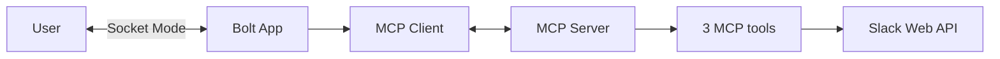

# Pace — a caring nudge for people burning out at LLM speed

**Submitted to: Slack Agent Builder Challenge — Slack Agent for Good track**

AI copilots let us work at their pace, not ours. Pace is a Slack agent that
notices when you've started chain-coding at LLM speed — long bursts of
high-velocity messages and PRs with barely a gap between them — and checks
in before that becomes a habit. It also sends a private weekly reflection
on your overall pace: nights worked late, longest stretch without a break,
and tone trend.

Every check-in is opt-in, private, and reversible. Pace never posts
publicly and never exposes an individual's activity to a manager — see
[`docs/privacy-and-consent.md`](docs/privacy-and-consent.md) for how that's
enforced in code, not just promised in this README.

## Features

- **Burst nudge (Concept A).** Detects a sustained high-velocity streak of
  messages/PRs and sends a private DM framed as a caring flag, not a
  scold, with quick actions: dismiss, remind me in 30 min, or block a
  walk on tomorrow's calendar.
- **Weekly digest (Concept C).** A private weekly DM summarizing nights
  worked late, longest no-break streak, and a tone trend — with actions to
  adjust check-in frequency, get a wellbeing resource, or give feedback.
- **Opt-in everywhere.** `/pace optin` / `/pace optout` / `/pace status`,
  plus an App Home tab showing status and the privacy principles inline.
- **Aggregate-only team view.** `get_team_aggregate_wellbeing` returns
  anonymized stats across opted-in users only — it has no per-user
  parameter, so individual data cannot be requested through it.

## Architecture

See [`docs/architecture.md`](docs/architecture.md) for the full diagram.
In short: Slack ⇄ Bolt App (Socket Mode) ⇄ MCP Client ⇄ MCP Server ⇄ three
tools (`get_user_activity_pattern`, `send_private_nudge`,
`get_team_aggregate_wellbeing`) ⇄ Slack Web API. The Bolt app never calls
detection or storage logic directly — every read or write goes through the
MCP boundary.



## Tech stack

- **Slack Bolt for JavaScript/TypeScript**, Socket Mode (no public
  endpoint needed for dev or demo recording).
- **MCP server integration** — the hackathon's required technology — via
  `@modelcontextprotocol/sdk`, run in-process using a linked
  `InMemoryTransport` pair for demo reliability; structured so it could run
  as a standalone `StdioServerTransport` process instead.
- **Block Kit** for all interactive UI (buttons, modals, App Home).
- **Zod** for MCP tool input schemas.
- **Vitest** for detection-logic and demo-pipeline tests.

## Setup / sandbox instructions

```bash
git clone <this-repo>
cd pace-machine
npm install
cp .env.example .env
# fill in .env — see docs/sandbox-setup.md for how to get each value
npm run dev
```

Full step-by-step (creating the Slack app from `manifest.json`, enabling
Socket Mode, generating tokens, granting judge test access) is in
[`docs/sandbox-setup.md`](docs/sandbox-setup.md).

### Try the two hero moments

```bash
npm run demo:burst -- --user=<your-slack-user-id>
npm run demo:digest -- --user=<your-slack-user-id>
```

Both seed synthetic, deterministic activity and fire a real DM into your
sandbox workspace via the `send_private_nudge` MCP tool — reproducible on
demand, no need to wait on real usage history.

## Demo video

`<link to be added>` — storyboard and recording checklist in
[`docs/demo-script.md`](docs/demo-script.md).

## Testing

```bash
npm test         # burst/digest detection unit tests
npm run typecheck
```

## License

MIT — see [`LICENSE`](LICENSE).
