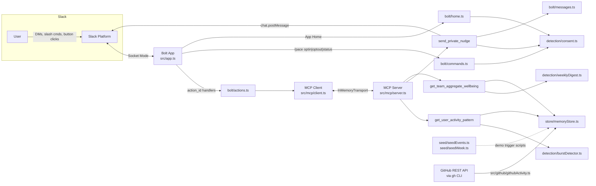

# Architecture

Pace is a Slack Bolt (Socket Mode) app with an in-process MCP server as the
integration seam between Slack and Pace's detection/store logic. The Bolt
app never calls detection or storage code directly — every read or action
goes through the MCP client, so MCP server integration is a real boundary,
not a decorative wrapper.

## Two data sources feeding the same detector

`detectBurst()` and `computeWeeklyDigest()` don't know or care where their
`ActivityEvent[]` input came from — there are two independent producers:

- **Seeded** (`src/seed/seedEvents.ts`, `src/seed/seedWeek.ts`) —
  deterministic synthetic data, used by `scripts/trigger-burst-demo.ts` and
  `scripts/trigger-digest-demo.ts` for a reliable, reproducible demo
  regardless of real usage history.
- **Real GitHub PR activity** (`src/github/githubActivity.ts`) — shells out
  to the already-authenticated `gh` CLI (`gh pr list --json ...`), so no
  GitHub token is ever read into this codebase's env or logs. Raw PRs are
  mapped to `ActivityEvent{type:'pr'}` records and run through the exact
  same `detectBurst()`. `scripts/poll-github-and-nudge.ts` is the live
  version of the burst-nudge trigger, sourced from genuine repo activity
  instead of synthetic events — `scripts/generate-demo-prs.ts` produces
  that real activity by creating and squash-merging a handful of small PRs
  in rapid succession.

## Why an in-process MCP server

For a 3-day build, running the MCP server as a linked `InMemoryTransport`
pair inside the same Node process eliminates cross-process/stdio flakiness
during live demo recording, while keeping the MCP tool-call boundary fully
real: the Bolt layer only ever talks to `src/mcp/client.ts`, never to
`detection/*` or `store/*` directly. The server could be moved to a
standalone `StdioServerTransport` process without changing any tool code.

## Privacy enforced by construction, not just policy

- `send_private_nudge` checks `consentStore.isOptedIn()` **inside the tool
  itself**, so no MCP client can bypass consent.
- `get_team_aggregate_wellbeing` has no `userId` parameter in its schema at
  all — per-user data literally cannot be requested through it.
